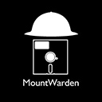

# MountWarden

Run custom code when a volume is mounted or umounted on MacOS.

## Description:

MountWarden catches MacOS mount events, to allow you to run custom code when a volume is mounted, is about to unmount, and when it is fully unmounted.

MountWarden consists of the following components:

	MountWarden              - The main binary that catches the volume mount events
	MountWarden-DidMount     - Called after a volume is mounted
	MountWarden-WillUnmount  - Called when a volume is about to unmount
	MountWarden-DidUnmount   - Called when a volume is fully unmounted
 
MountWarden-DidMount, MountWarden-UWillUnmount and MountWarden-DidUnmount are bash scripts.

These example scripts use the "say" command to speak whenever there is a mount event. You should customise the scripts to your own needs.

## How to install:

Download the MountWarden installation package here [MountWarden.pkg](https://raw.githubusercontent.com/execriez/MountWarden/master/SupportFiles/MountWarden.pkg)

The installer will install the following files and directories:

	/Library/LaunchDaemons/com.github.execriez.mountwarden.plist
	/usr/MountWarden/
	/usr/MountWarden/bin/
	/usr/MountWarden/bin/MountWarden
	/usr/MountWarden/bin/MountWarden-DidMount
	/usr/MountWarden/bin/MountWarden-WillUnmount
	/usr/MountWarden/bin/MountWarden-DidUnmount

There's no need to reboot.

After installation, your computer will speak whenever a volume is mounted or unmounted. 

If the installer fails you should check the installation logs.

## Modifying the example scripts:

After installation, three simple example scripts can be found in the following location:

	/usr/MountWarden/bin/MountWarden-DidMount
	/usr/MountWarden/bin/MountWarden-WillUnmount
	/usr/MountWarden/bin/MountWarden-DidUnmount

These simple scripts use the "say" command to speak whenever a volume is mounted or unmounted. Modify the scripts to alter this default behaviour.

**MountWarden-DidMount**

	#!/bin/bash
	#
	# Called as root like this:
	#   MountWarden-DidMount "DidMount:Epoch:VolumePath"
	# i.e.
	#   MountWarden-DidMount "DidMount:1538163950:/Volumes/MYFATDISK"

	# Get volume path
	sv_ThisVolumePath="$(echo ${1} | cut -d":" -f3)"

	# Do something
	say "${sv_ThisVolumePath} did mount."

**MountWarden-WillUnmount**

	#!/bin/bash
	#
	# Called as root like this:
	#   MountWarden-WillMount "WillMount:Epoch:VolumePath"

	# Get volume path
	sv_ThisVolumePath="$(echo ${1} | cut -d":" -f3)"

	# Do something
	say "${sv_ThisVolumePath} will unmount."

**MountWarden-DidUnmount**

	#!/bin/bash
	#
	# Called as root like this:
	#   MountWarden-DidUnmount "DidUnmount:Epoch:VolumePath"

	# Get volume path
	sv_ThisVolumePath="$(echo ${1} | cut -d":" -f3)"

	# Do something
	say "${sv_ThisVolumePath} did unmount."

## How to uninstall:

Download the MountWarden uninstaller package here [MountWarden-Uninstaller.pkg](https://raw.githubusercontent.com/execriez/MountWarden/master/SupportFiles/MountWarden-Uninstaller.pkg)

The uninstaller will remove the following files and directories:

	/Library/LaunchDaemons/com.github.execriez.mountwarden.plist
	/usr/MountWarden/

After the uninstall everything goes back to normal, and volume mounting will not be tracked.

There's no need to reboot.

## Logs:

The MountWarden binary writes to the following log file:

	/var/log/systemlog
  
The following is an example of a typical system log file entry:

	Sep 24 22:08:30 mymac-01 MountWarden[97555]: Did mount: '/Volumes/DELB4LOGOUT'
	Sep 24 22:08:40 mymac-01 MountWarden[97555]: Will unmount: '/Volumes/DELB4LOGOUT'
	Sep 24 22:08:40 mymac-01 MountWarden[97555]: Did unmount: '/Volumes/DELB4LOGOUT'

The installer writes to the following log file:

	/Library/Logs/com.github.execriez.mountwarden.log
  
You should check this log if there are issues when installing.

## History:

1.0.1 - 28 SEP 2018

* First public release.

